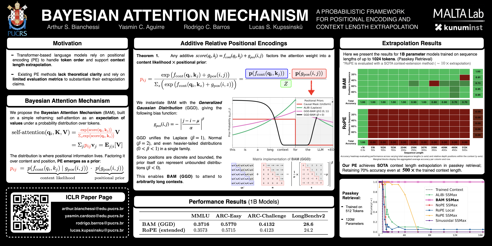

# Bayesian Attention Mechanism

<p align="center">
  <a href="https://openreview.net/forum?id=dXJB9O8fLd"></a>
  <a href="https://arxiv.org/abs/2505.22842"></a>
  <a href="https://iclr.cc/virtual/2026/poster/10008400"></a>
  <a href="assets/poster.pdf"></a>
  <a href="assets/slides.pdf"></a>
</p>

This repository contains the implementation of the Bayesian Attention Mechanism (BAM) as described in the paper "Bayesian Attention Mechanism: A Probabilistic Framework for Positional Encoding and Context Length Extrapolation" by Arthur S. Bianchessi, Yasmin Aguirre, Rodrigo C. Barros and Lucas S. Kupssinsku, published at ICLR 2026. The training code was adapted from [llm.c](https://github.com/karpathy/llm.c), and we used [llama 3](https://github.com/meta-llama/llama-models/blob/main/models/llama3/model.py) as a template for our models.

[](assets/poster.pdf)

## Highlights
BAM reframes positional encoding as a prior in a probabilistic attention model, unifying methods such as NoPE and ALiBi under a single framework and motivating a Generalized Gaussian positional prior. Empirically, BAM:

- retrieves information accurately at up to **500×** the training context length,
- improves over the previous state of the art in context-length generalization by more than **25×** in retrieval accuracy,
- maintains comparable perplexity while adding **minimal extra parameters** (two trained scalars per attention head).

## Installation
To install the required dependencies, run the following command:

```bash
pip install -r requirements.txt
```

## Usage
To train the BAM model, first prepare your dataset with the following command:

```bash
python dataset.py
```

This creates a tokenized dataset file in `data/`, from the [FineWeb 10B token sample](https://huggingface.co/datasets/HuggingFaceFW/fineweb) using the [Mistral 7B](https://huggingface.co/mistralai/Mistral-7B-Instruct-v0.3) tokenizer. If you want to use larger datasets, the `--streaming` option can be used to stream the dataset from Hugging Face.

To train the BAM model as described in the paper, run the following command, adapting `--nproc_per_node` and `--batch_size` to your hardware (the two combined with `--tokens_per_step` determine the gradient-accumulation steps):

```bash
time torchrun --standalone --nproc_per_node '<customize>' \
    train.py \
        --num_iterations=20000 \
        --tokens_per_step=589824 \
        --position_encoding=bam_ssmax \
        --model_size=l12 \
        --sequence_length=512 \
        --batch_size='<customize>' \
        --weight_decay=0.1 \
        --learning_rate_decay_frac=0.1 \
        --compile \
        --tensorcores \
        --val_loss_every=32 \
        --dtype=bfloat16 \
        --learning_rate=1e-3
```

`--num_iterations` is required. At `--tokens_per_step=589824`, roughly 20,000 iterations correspond to a single epoch over the FineWeb 10B sample. Pick `--nproc_per_node` and `--batch_size` to fit your GPUs; gradient accumulation makes up the remainder of `--tokens_per_step` automatically.

### Options
The same script reproduces every model in the paper by varying two flags:

- `--position_encoding`: `nope`, `nope_ssmax`, `sinusoidal`, `sinusoidal_ssmax`, `rotary`, `rotary_ssmax`, `alibi`, `alibi_ssmax`, `bam`, `bam_ssmax`
- `--model_size`: `l6`, `l8`, `l12`, `l15`, `l18`, `l24`

The `_ssmax` variants enable [Scalable-Softmax](https://arxiv.org/abs/2501.19399). BAM-specific knobs (`--theta_alpha_init`, `--thata_beta_init`, `--theta_mu_init`, `--global_prior`, `--prior_lr`, …) are documented via `python train.py --help`. Note that `--theta_mu_trainable` defaults to `0`, so BAM trains two scalars per head (`theta_alpha`, `theta_beta`) unless you enable the offset with `--theta_mu_trainable=1`.

Each run writes checkpoints, configs, and metrics to `logs/<model_size>/<position_encoding>/version_NN/`. The full paper sweep is the Cartesian product of the two lists above (60 runs); each individual run uses the command shown earlier with the corresponding flag values.

## Evaluation
To evaluate a trained model, run:

```bash
python evaluate.py --log_dir '<path_to_your_model_log_dir>'
```

This runs the passkey-retrieval task across context lengths up to 32,768 tokens (the context-length extrapolation experiment from the paper). Add `--perplexity` to also report perplexity on Wikipedia articles. Considering a single run of the training example above, the log directory would be `logs/l12/bam_ssmax/version_00`.

## Implementation Details

The Bayesian Attention Mechanism is implemented in [`models/bam.py`](models/bam.py) and [`models/bam_ssmax.py`](models/bam_ssmax.py); baseline encodings (NoPE, sinusoidal, RoPE, ALiBi) live alongside them in [`models/`](models/) for direct comparison.

The core of BAM is a per-head additive attention bias derived from a Generalized Gaussian positional prior:

$$
B_{ij} \;=\; -\,e^{\theta_\alpha}\,\bigl(\,\lvert (i - j) - \mu \rvert + \varepsilon\,\bigr)^{\theta_\beta},
\qquad \mu = e^{\theta_\mu} - e^{-\theta_\mu},
$$

where $\theta_\alpha$ (log-scale) and $\theta_\beta$ (shape) are learned per attention head, while the offset $\theta_\mu$ is held fixed by default (enable with `--theta_mu_trainable=1`). The corresponding code is:

```python
class AttentionPrior(nn.Module):
    def __init__(self, args: SSMaxBATModelArgs):
        super().__init__()
        self.seq_len = args.max_seq_len
        self.n_heads = args.n_heads
        self.eps = 1e-5

        if args.theta_alpha_init == 'slope':
            theta_alpha = torch.tensor(get_slopes(args.n_heads), dtype=torch.float).reshape(1, args.n_heads, 1, 1)
        elif args.theta_alpha_init == 'sampled':
            theta_alpha = torch.randn((1, args.n_heads, 1, 1), dtype=torch.float).exp()
        else:
            theta_alpha = torch.full((1, args.n_heads, 1, 1), float(args.theta_alpha_init), dtype=torch.float)

        if args.train_theta_beta and args.thata_beta_init == 'linear':
            theta_beta = torch.linspace(0, 1, args.n_heads, dtype=torch.float).reshape(1, args.n_heads, 1, 1)
        elif args.train_theta_beta and args.thata_beta_init == 'sampled':
            theta_beta = torch.randn((1, args.n_heads, 1, 1), dtype=torch.float)
        elif args.train_theta_beta:
            theta_beta = torch.full((1, args.n_heads, 1, 1), float(args.thata_beta_init), dtype=torch.float)
        else:
            theta_beta = torch.ones((1, args.n_heads, 1, 1), dtype=torch.float)

        theta_mu = torch.full((1, args.n_heads, 1, 1), float(args.theta_mu_init), dtype=torch.float)

        self.theta_alpha = nn.Parameter(theta_alpha, requires_grad=args.train_theta_alpha)
        self.theta_beta  = nn.Parameter(theta_beta,  requires_grad=args.train_theta_beta)
        self.theta_mu    = nn.Parameter(theta_mu,    requires_grad=args.train_theta_mu)

    def forward(self, seq_len=None):
        seq_len = seq_len or self.seq_len
        positions = torch.arange(seq_len, device=self.theta_alpha.device).float()
        b = (positions[None, :] - positions[:, None]).reshape(1, 1, seq_len, seq_len)
        b = b - (self.theta_mu.exp() - (-self.theta_mu).exp())
        return -((b.abs() + self.eps) ** self.theta_beta) * self.theta_alpha.exp()
```

## Repository Layout

```
BAM/
├── train.py            # llm.c-derived training loop (DDP, gradient accumulation, bfloat16)
├── evaluate.py         # passkey-retrieval + optional Wikipedia perplexity
├── dataset.py          # tokenizes FineWeb 10B with the Mistral 7B tokenizer
├── eval_utils.py       # passkey synthesis and scoring
├── utils.py            # shared training/eval helpers
├── requirements.txt
├── models/             # one file per positional-encoding variant
│   ├── bam.py          ├── bam_ssmax.py
│   ├── alibi.py        ├── alibi_ssmax.py
│   ├── rotary.py       ├── rotary_ssmax.py
│   ├── sinusoidal.py   ├── sinusoidal_ssmax.py
│   ├── nope.py         └── nope_ssmax.py
├── assets/             # poster.{pdf,png}, slides.pdf
└── logs/               # checkpoints and metrics, populated by train.py
```

## Citation
If you use this code or the Bayesian Attention Mechanism in your research, please cite:

```bibtex
@inproceedings{bianchessi2026bayesian,
  title     = {Bayesian Attention Mechanism: A Probabilistic Framework for Positional Encoding and Context Length Extrapolation},
  author    = {Bianchessi, Arthur S. and Aguirre, Yasmin and Barros, Rodrigo C. and Kupssinsk{\"u}, Lucas S.},
  booktitle = {International Conference on Learning Representations (ICLR)},
  year      = {2026},
  url       = {https://openreview.net/forum?id=dXJB9O8fLd},
  eprint    = {2505.22842},
  archivePrefix = {arXiv}
}
```